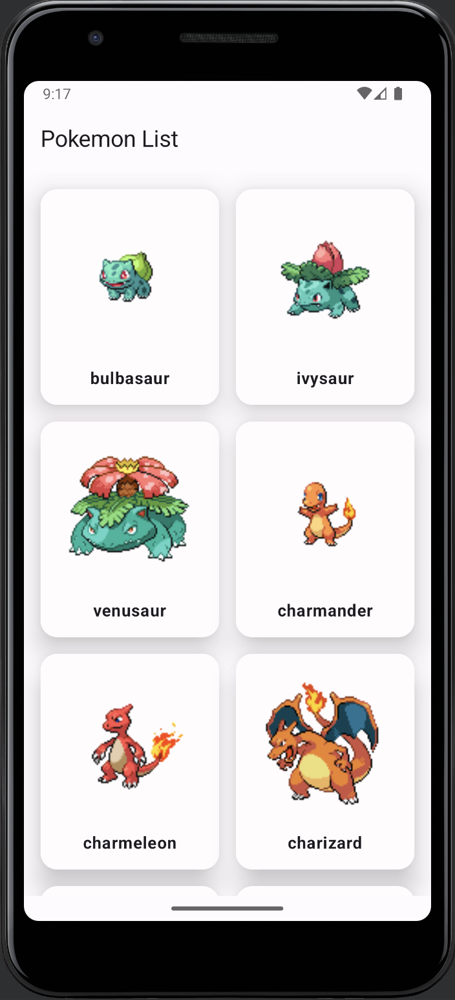
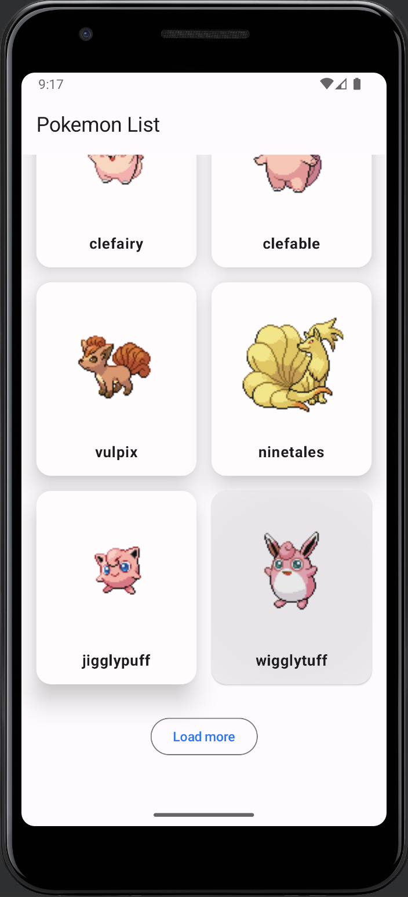
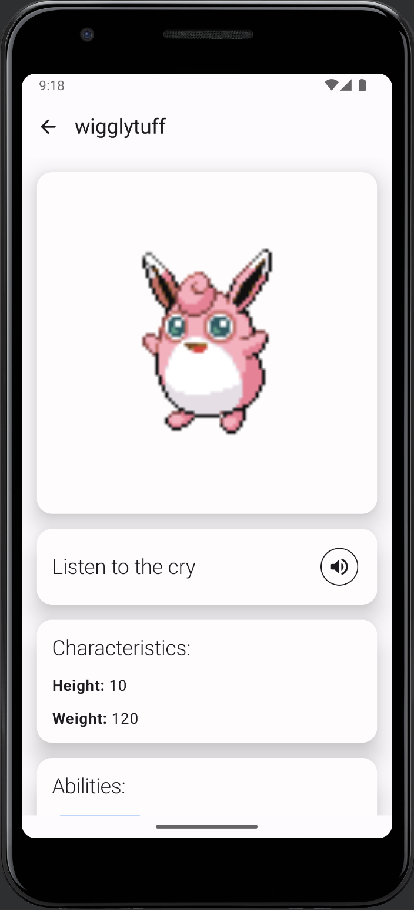
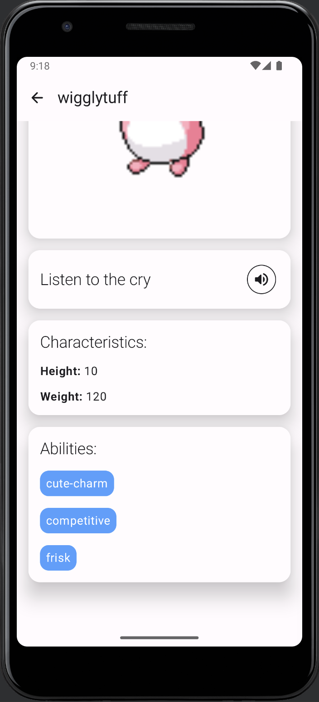

# VKTestPokemon

VKTestPokemon - это приложение, которое позволяет просматривать список покемонов и получать дополнительную информацию о каждом из них. Данные о покемонах предоставляются через API [pokeapi.co](https://pokeapi.co/).

## Экраны

### 1. Список покемонов

  
  

На этом экране отображается список покемонов. Пользователь может прокручивать список и выбирать покемона, чтобы узнать о нем больше. Реализована подгрузка покемонов по 20 штук.

### 2. Детальная информация о покемоне

  
  

После выбора покемона на экране списка, пользователь переходит на экран с подробной информацией о выбранном покемоне. Здесь отображается информация о его характеристиках и способностях. Также пользователь имеет возможность прослушать боевой клич.

## Стек технологий

Приложение разработано с использованием следующих технологий:

- **Jetpack Compose**
  
- **MVIKotlin**

- **Decompose**

- **Retrofit**

- **Coroutines**

## Запуск приложения

Для запуска приложения, убедитесь, что ваше устройство удовлетворяет следующим требованиям:

- Android-устройство с версией ОС Android 10.0 (API 29) или выше.

После этого, клонируйте репозиторий с приложением, откройте проект в среде разработки Android Studio и запустите его на эмуляторе или физическом устройстве.
